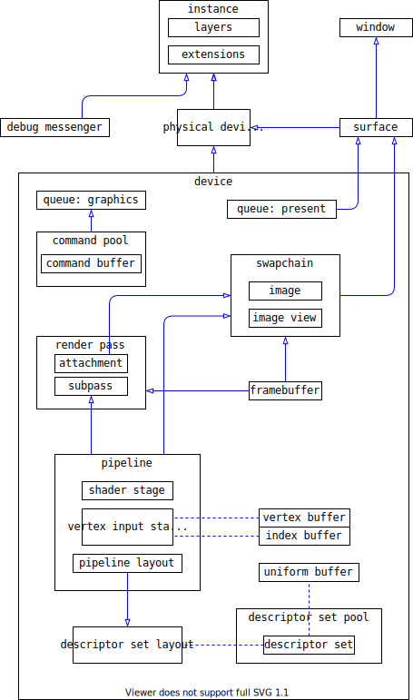

This is my real-time renderer, which I use to learn Rulkan and real-time rendering techniques.

### My understanding of vulkan

### TODO

- [ ] learn vulkan tutorial
- [ ] shadow map
- [ ] pcss, pcf
- [ ] ssao, ssdo
- [ ] ssr
