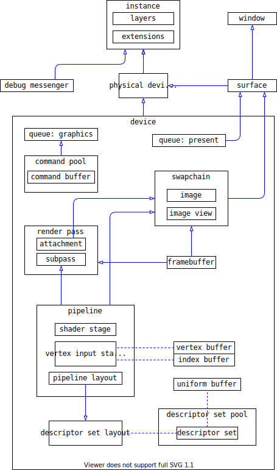

This is my real-time renderer, which I use to learn Rulkan and real-time rendering techniques.

### about code

window resize 后发生的事情：
* 重新创建 surface，获得 surface 的 extent
* 创建 swapchain，因为要根据 surface 的尺寸修改 image 的尺寸
* 重新创建 pipeline，因为需要修改 viewport 尺寸
* 重新创建 framebuffer

各种资源初始化的顺序：
* spdlog 的 logger
* glfwwindow
* vulkan 的 instance
* vulkan 的 debug util：msger
* env 相关：
    * surface
    * physical device
    * logical device，queue
    * command pool

### My understanding of vulkan

### temp

mipmap 的方法：
* 从 picture 读入数据，将数据存储到 stage buffer
* 数据从 stage buffer 放入 image 的 level 0
* 根据 level 0 生成后续的 level
* 生成对应的 sampler
* 将 sampler 和 image view 组合在一起，生成 descriptor

### TODO

- [ ] learn vulkan tutorial
- [ ] shadow map
- [ ] pcss, pcf
- [ ] ssao, ssdo
- [ ] ssr

$$
\int_i^x x^2 = 1
$$
